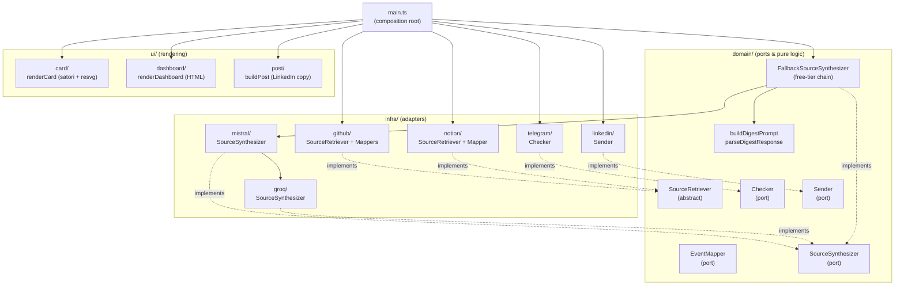
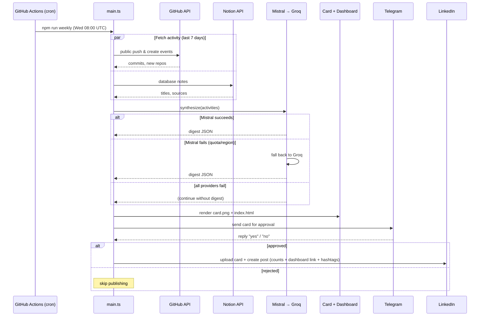

# Weekly Changelog

Automated weekly summary of your engineering activity. Every week it collects what
you did across **GitHub** (commits, new repos, forks) and **Notion** (notes), asks a
**free-tier LLM** to write an impersonal digest of the changes, renders a shareable
**social card** (PNG) and a responsive **dashboard** (HTML), and sends the card to
**Telegram** for you to approve before anything is published.

Designed to run entirely on **free tiers** — no paid API calls, ever.

---

## What it produces

| Output | File | Purpose |
|--------|------|---------|
| Social card | `docs/card.png` | 1200×760 product-changelog PNG for LinkedIn/X — **Shipped** bullets (from feat/fix/refactor commits), **Learned** bullets (Notion notes), and a raw-stats bar (commits · notes · lines changed · repos). Deterministic, **no AI**. |
| Dashboard | `docs/index.html` | Responsive light/dark page — evidence-backed AI highlights, a **metrics** panel, a **weekly timeline**, raw commits grouped by repo with diff stats, new repos, and detailed learnings. Served via GitHub Pages. |
| Approval | Telegram message | The card is sent to your chat; reply `yes` to approve or `no` to reject before publishing. |
| LinkedIn post | On approval | The card is posted natively with a **deterministic, no-AI caption** — raw counts (commits across repos, new repos, notes taken), the dashboard link, and hashtags. |

---

## Architecture

The codebase follows a **ports & adapters (hexagonal)** style: the `domain/` layer
defines interfaces (ports) and pure logic with zero knowledge of any external
service; each `infra/` adapter implements one port against a concrete provider.
`main.ts` is the composition root that wires everything together.



### Why the ports matter

- **`SourceSynthesizer`** is the "AI piece" abstraction. `FallbackSourceSynthesizer`
  implements it by wrapping an ordered list of providers: it tries each in turn and
  falls through to the next on any error (rate limit, quota exhausted, region block).
  Adding or swapping an LLM provider is a new adapter — no change to the callers.
- **`SourceRetriever`** normalizes any activity source into a common `Activity`.
  GitHub and Notion are just two adapters; a future source (e.g. GitLab, PRs) is another.
- **`Checker`** is the human-approval gate. Telegram is one implementation.
- **`Sender`** publishes the approved post. LinkedIn is one implementation; another
  network (X, Mastodon) would be a new adapter over the same `Post`.

---

## Weekly flow



The pipeline **never hard-fails on the AI step**: if every provider is unavailable,
the card and dashboard are still produced (without the AI digest) and the approval
is still sent.

---

## Project structure

```
src/
├── domain/                     # Ports & pure logic (no I/O)
│   ├── Activity.ts             # Normalized activity + 7-day window check
│   ├── ActivityMeta.ts         # Event-type discriminators & type guards
│   ├── SourceRetriever.ts      # Abstract retriever (fetch → map → filter)
│   ├── EventMapper.ts          # Port: raw event → Activity
│   ├── SourceSynthesizer.ts    # Port: activities → AI digest
│   ├── FallbackSourceSynthesizer.ts  # Free-tier provider chain
│   ├── SynthesizedDigest.ts    # Digest shape (evidence-backed highlights) + validation
│   ├── buildDigestPrompt.ts    # Impersonal-tone prompt builder
│   ├── parseDigestResponse.ts  # Strict JSON parse + shape guard
│   ├── computeMetrics.ts       # 8 code-activity metrics (pure)
│   ├── commitType.ts           # Conventional-commit classifier (atomic proxy)
│   ├── languageFromPath.ts     # File path → display language
│   ├── buildTimeline.ts        # Chronological typed events + metadata
│   ├── Checker.ts              # Port: human approval gate
│   ├── Post.ts                 # Post payload (text + image + link)
│   └── Sender.ts              # Port: publish an approved post
├── infra/                      # Adapters (one folder per provider)
│   ├── github/                 # Retriever + push/create/fork mappers
│   ├── notion/                 # Retriever + note mapper
│   ├── mistral/                # Primary LLM adapter
│   ├── groq/                   # Fallback LLM adapter
│   ├── telegram/               # Approval adapter (Checker)
│   └── linkedin/               # Publishing adapter (Sender)
├── ui/
│   ├── card/                   # satori + resvg → PNG (fixed design)
│   ├── dashboard/              # HTML string builder (light/dark, responsive)
│   ├── post/                   # buildPost — LinkedIn-optimized copy
│   └── fonts/                  # Poppins .ttf (bundled into dist on build)
└── main.ts                     # Composition root

docs/                           # Published output (GitHub Pages)
tests/                          # Vitest use-case tests, mirrors src/
```

---

## Setup

### 1. Install

```bash
npm ci
```

### 2. Environment variables

Create a `.env` (git-ignored) for local runs:

```dotenv
# GitHub
GITHUB_TOKEN=          # fine-grained PAT, read-only
GITHUB_USERNAME=       # your GitHub login

# Notion
NOTION_API_KEY=        # internal integration token
NOTION_DATABASE_ID=    # data source id of your notes database

# LLM providers (free tier) — tried in order, Mistral first
MISTRAL_API_KEY=       # console.mistral.ai
GROQ_API_KEY=          # console.groq.com

# Telegram approval
TELEGRAM_BOT_TOKEN=    # from @BotFather
TELEGRAM_CHAT_ID=      # your chat id

# LinkedIn publishing (Posts API — scope w_member_social)
LINKEDIN_ACCESS_TOKEN= # member access token
LINKEDIN_AUTHOR_URN=   # e.g. urn:li:person:xxxxxxxx

# Optional: overrides the default https://<user>.github.io/weekly-changelog/
DASHBOARD_URL=
```

### 3. Run locally

```bash
npm run build      # tsc + copy fonts into dist/
npm run weekly     # runs dist/main.js end-to-end
# or, without building:
npm run dev        # tsx src/main.ts
```

### 4. Automated weekly run (GitHub Actions)

The workflow `.github/workflows/generate-weekly-post.yml` runs every **Wednesday at
08:00 UTC** (and on manual `workflow_dispatch`). Configure in your repo:

- **Secrets:** `GH_TOKEN`, `NOTION_API_KEY`, `MISTRAL_API_KEY`, `GROQ_API_KEY`, `TELEGRAM_BOT_TOKEN`, `LINKEDIN_ACCESS_TOKEN`
- **Variables:** `USERNAME`, `NOTION_DATABASE_ID`, `TELEGRAM_CHAT_ID`, `LINKEDIN_AUTHOR_URN`

---

## Zero-cost design

Every moving part is chosen to stay within a permanent free tier — not a trial.

| Component | Free-tier reason |
|-----------|------------------|
| **GitHub Actions** | Free & unlimited minutes for **public** repos. Keep this repo public. |
| **GitHub Pages** | Free static hosting for public repos. |
| **GitHub API** | Well within the authenticated rate limit (a handful of calls/week). |
| **Notion API** | Free for internal integrations. |
| **Mistral (primary)** | Free tier, no card required; EU provider (no region block). One call/week. |
| **Groq (fallback)** | Generous free tier, no card required. Only called if Mistral fails. |
| **Telegram Bot API** | Free. |
| **LinkedIn Posts API** | Free (one post per approved week). |
| **Rendering (satori + resvg)** | Runs locally on the runner — no external service. |

**Cost guardrails already in the code:**

- The LLM chain makes **at most one successful call per week**; a provider is only
  retried by falling through to the *next* provider, never in a loop.
- GitHub `compareCommits` enrichment is **skipped for non-public and non-push
  events**, so no API calls are wasted on data that would be discarded.
- If the repo is ever made **private**, Actions minutes become metered (2000/month
  free). The Telegram approval waits up to 30 minutes per run (~130 min/month) —
  still within free tier, but reduce the timeout in `TelegramChecker` if needed.

> **External CDN caveat (not a cost, but a dependency):** the card fetches Twemoji
> SVGs from jsDelivr at render time, and the dashboard links Google Fonts for the
> viewer's browser. Both are free; if jsDelivr is unreachable, emoji simply fail to
> render.


### Publishing on approval

When you reply `yes`, the run: (1) signals the workflow via a step output, (2) posts
the card to LinkedIn, and (3) a subsequent workflow step — gated on that output —
commits the freshly generated `docs/` back to the repo, which rebuilds GitHub Pages.
Rejecting skips all three. The dashboard URL is stable, so the LinkedIn link resolves
to the updated page once Pages finishes rebuilding (usually under a minute).

---

## Development

```bash
npm test           # vitest run — use-case tests for every adapter & pure module
npm run test:watch # watch mode
npm run build      # typecheck + emit dist/ + copy fonts
```

Tests mirror `src/` under `tests/` and cover the retrievers, the LLM adapters
(mocked `fetch`), the fallback chain, the Telegram approval loop (fake timers), and
the card/dashboard data builders.
```
